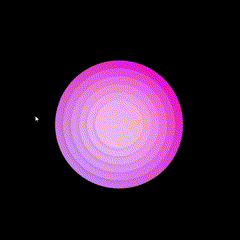

# CSS 3D Circle Animation Tutorial

Hey there! 👋  
Welcome to my cute little CSS animation project! This web app shows off a fun 3D hover effect made using just HTML and CSS — no JavaScript needed   
I made this to help other IT students explore how creative and playful CSS can be. Hope it inspires you to try out some fun ideas of your own!

---
## 🎬 Animation Preview

<p align="center">
  
</p>

## 🚀 Project Demo

👉 [Click here to try it out!](https://sarsbars.github.io/css-tutorial/)

---

## 📁 Project Structure

```
/project-folder
│
├── index.html
├── assets/
│   └── style.css
└── README.md
```

## 💡 What This Project Teaches

- How to use CSS transitions and transforms
- Creating cute 3D effects with `rotate3d` and `translate3d`
- Structuring reusable circle layers using the `:nth-child()` selector
- Adding hover animations without any JavaScript
- Using gradients to add a pop of color 💅


## 🧠 Key Code Snippets
📍Snippet 1: HTML Structure of the Animated Card
```html
<div class="card">
    <div class="circle"></div>
    <div class="circle"></div>
    <div class="circle"></div>
    <div class="circle"></div>
    <div class="circle"></div>
</div>
```
Quick Note:
This creates five layered .circle divs inside a main .card container. They stack nicely and animate when you hover over the card!

📍Snippet 2: CSS Hover Animation Using translate3d()

```css
.card:hover .circle:nth-child(1) {
    transform: translate3d(0, 0, 30px); 
}

.card:hover .circle:nth-child(2) {
    transform: translate3d(0, 0, 60px); 
}

.card:hover .circle:nth-child(3) {
    transform: translate3d(0, 0, 90px); 
}

.card:hover .circle:nth-child(4) {
    transform: translate3d(0, 0, 120px); 
}

.card:hover .circle:nth-child(5) {
    transform: translate3d(0, 0, 150px); 
}
```

What's Happening:
Each circle moves up along the Z-axis a little more than the last one. This creates a cool layered 3D effect when you hover. I used transition-delay to make them move one after the other — kind of like a ripple effect.

📍Snippet 3: Gradient Background on .card

.card {
    background: linear-gradient(45deg, #cba5fe, #ff20bd);
    height: 400px;
    width: 400px;
    border-radius: 50%;
}

## ✨ Features
- ✅ Pure HTML + CSS only
- ✅ Interactive hover effect
- ✅ 3D layered animation
- ✅ Responsive and centered layout
- ✅ Great for visual learners

## 👩‍💻 Author
Sarah Mitchell
Software Development Student 

